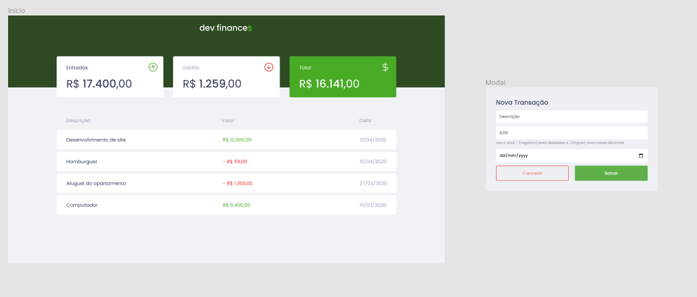

# devFinance

projeto desenvolvido na maratona discover da Rocketseat. Abaixo imagem do projeto original e link para visualizacao do demo com alterações feitas

# Imagem do projeto original

# Imagens do projeto apos modificações

O Título do form mudará de acordo com a opção de transação escolhida.

O lançamento do debito será lançando sem a necessidade do sinal de menos(-).

# Link demo do projeto apos modificações

<a href="https://devfinance-eosin.vercel.app/?#"> => devFinance</a>
## Tecnologias usadas no projeto

- HTML
- CSS
- JAVASCRIPT

## Features 

- Form opção transacao.
- Não há necessidade de digitar o sinal de menos(-) antes do número na opção de débito.
- Titulo do form muda de acordo com a opção da transacao. (ex: se debito será:NOVA TRANSAÇÃO DE DÉBTIO, se crédito: NOVA TRANSAÇÃO DE CRÉDITO)

## Autor

Josimar Jose - Estudante e amante de tecnologia, em busca do próximo nível.

